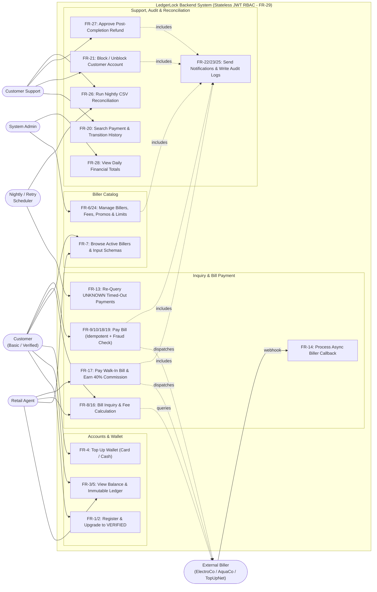

# 01 — Use Case Diagram

```mermaid
flowchart LR
%% Actors
    Customer(["Customer<br/>(Basic / Verified)"])
    Agent(["Retail Agent"])
    Support(["Customer Support"])
    Admin(["System Admin"])
    Biller(["External Biller<br/>(ElectroCo / AquaCo / TopUpNet)"])
    Scheduler(["Nightly / Retry<br/>Scheduler"])

    subgraph LedgerLock["LedgerLock Backend System (Stateless JWT RBAC - FR-29)"]
        direction TB

        subgraph Accounts["Accounts & Wallet"]
            UC1["FR-1/2: Register & Upgrade to VERIFIED"]
            UC2["FR-3/5: View Balance & Immutable Ledger"]
            UC3["FR-4: Top Up Wallet (Card / Cash)"]
        end

        subgraph Catalog["Biller Catalog"]
            UC4["FR-7: Browse Active Billers & Input Schemas"]
            UC5["FR-6/24: Manage Billers, Fees, Promos & Limits"]
        end

        subgraph Payments["Inquiry & Bill Payment"]
            UC6["FR-8/16: Bill Inquiry & Fee Calculation"]
            UC7["FR-9/10/18/19: Pay Bill (Idempotent + Fraud Check)"]
            UC8["FR-17: Pay Walk-In Bill & Earn 40% Commission"]
            UC9["FR-14: Process Async Biller Callback"]
            UC10["FR-13: Re-Query UNKNOWN Timed-Out Payments"]
        end

        subgraph Ops["Support, Audit & Reconciliation"]
            UC11["FR-20: Search Payment & Transition History"]
            UC12["FR-21: Block / Unblock Customer Account"]
            UC13["FR-27: Approve Post-Completion Refund"]
            UC14["FR-26: Run Nightly CSV Reconciliation"]
            UC15["FR-28: View Daily Financial Totals"]
            UC16["FR-22/23/25: Send Notifications & Write Audit Logs"]
        end
    end

%% Customer Associations
    Customer --> UC1
    Customer --> UC2
    Customer --> UC3
    Customer --> UC4
    Customer --> UC6
    Customer --> UC7
%% Agent Associations
    Agent --> UC2
    Agent --> UC4
    Agent --> UC6
    Agent --> UC8
%% Support Associations
    Support --> UC11
    Support --> UC12
    Support --> UC13
    Support --> UC14
%% Admin Associations
    Admin --> UC5
    Admin --> UC15
%% External & System Associations
    UC6 -.->|queries| Biller
    UC7 -.->|dispatches| Biller
    UC8 -.->|dispatches| Biller
    Biller -->|webhook| UC9
    Scheduler --> UC10
    Scheduler --> UC14
%% Include / Trigger Relationships
    UC7 -.->|includes| UC16
    UC8 -.->|includes| UC16
    UC5 -.->|includes| UC16
    UC12 -.->|includes| UC16
    UC13 -.->|includes| UC16
```
