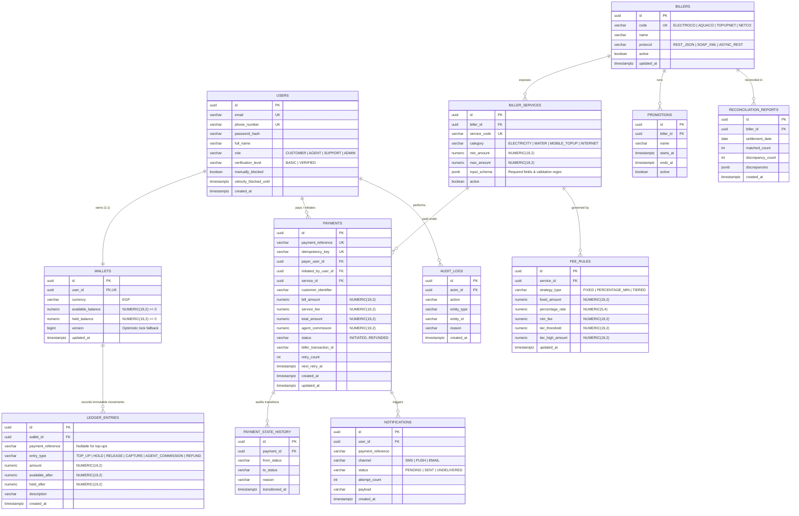

# 05 — Entity-Relationship (ER) Diagram (PostgreSQL 17)

```mermaid
erDiagram
    USERS ||--|| WALLETS: "owns (1:1)"
    WALLETS ||--o{ LEDGER_ENTRIES: "records immutable movements"
    USERS ||--o{ PAYMENTS: "pays / initiates"
    BILLERS ||--o{ BILLER_SERVICES: "exposes"
    BILLER_SERVICES ||--o{ PAYMENTS: "paid under"
    BILLER_SERVICES ||--o{ FEE_RULES: "governed by"
    BILLERS ||--o{ PROMOTIONS: "runs"
    PAYMENTS ||--o{ PAYMENT_STATE_HISTORY: "audits transitions"
    PAYMENTS ||--o{ NOTIFICATIONS: "triggers"
    USERS ||--o{ AUDIT_LOGS: "performs"
    BILLERS ||--o{ RECONCILIATION_REPORTS: "reconciled in"

    USERS {
        uuid id PK
        varchar email UK
        varchar phone_number UK
        varchar password_hash
        varchar full_name
        varchar role "CUSTOMER | AGENT | SUPPORT | ADMIN"
        varchar verification_level "BASIC | VERIFIED"
        boolean manually_blocked
        timestamptz velocity_blocked_until
        timestamptz created_at
    }

    WALLETS {
        uuid id PK
        uuid user_id FK, UK
        varchar currency "EGP"
        numeric available_balance "NUMERIC(19,2) >= 0"
        numeric held_balance "NUMERIC(19,2) >= 0"
        bigint version "Optimistic lock fallback"
        timestamptz updated_at
    }

    LEDGER_ENTRIES {
        uuid id PK
        uuid wallet_id FK
        varchar payment_reference "Nullable for top-ups"
        varchar entry_type "TOP_UP | HOLD | RELEASE | CAPTURE | AGENT_COMMISSION | REFUND"
        numeric amount "NUMERIC(19,2)"
        numeric available_after "NUMERIC(19,2)"
        numeric held_after "NUMERIC(19,2)"
        varchar description
        timestamptz created_at
    }

    BILLERS {
        uuid id PK
        varchar code UK "ELECTROCO | AQUACO | TOPUPNET | NETCO"
        varchar name
        varchar protocol "REST_JSON | SOAP_XML | ASYNC_REST"
        boolean active
        timestamptz updated_at
    }

    BILLER_SERVICES {
        uuid id PK
        uuid biller_id FK
        varchar service_code UK
        varchar category "ELECTRICITY | WATER | MOBILE_TOPUP | INTERNET"
        numeric min_amount "NUMERIC(19,2)"
        numeric max_amount "NUMERIC(19,2)"
        jsonb input_schema "Required fields & validation regex"
        boolean active
    }

    FEE_RULES {
        uuid id PK
        uuid service_id FK
        varchar strategy_type "FIXED | PERCENTAGE_MIN | TIERED"
        numeric fixed_amount "NUMERIC(19,2)"
        numeric percentage_rate "NUMERIC(5,4)"
        numeric min_fee "NUMERIC(19,2)"
        numeric tier_threshold "NUMERIC(19,2)"
        numeric tier_high_amount "NUMERIC(19,2)"
        timestamptz updated_at
    }

    PROMOTIONS {
        uuid id PK
        uuid biller_id FK
        varchar name
        timestamptz starts_at
        timestamptz ends_at
        boolean active
    }

    PAYMENTS {
        uuid id PK
        varchar payment_reference UK
        varchar idempotency_key UK
        uuid payer_user_id FK
        uuid initiated_by_user_id FK
        uuid service_id FK
        varchar customer_identifier
        numeric bill_amount "NUMERIC(19,2)"
        numeric service_fee "NUMERIC(19,2)"
        numeric total_amount "NUMERIC(19,2)"
        numeric agent_commission "NUMERIC(19,2)"
        varchar status "INITIATED..REFUNDED"
        varchar biller_transaction_id
        int retry_count
        timestamptz next_retry_at
        timestamptz created_at
        timestamptz updated_at
    }

    PAYMENT_STATE_HISTORY {
        uuid id PK
        uuid payment_id FK
        varchar from_status
        varchar to_status
        varchar reason
        timestamptz transitioned_at
    }

    NOTIFICATIONS {
        uuid id PK
        uuid user_id FK
        varchar payment_reference
        varchar channel "SMS | PUSH | EMAIL"
        varchar status "PENDING | SENT | UNDELIVERED"
        int attempt_count
        varchar payload
        timestamptz created_at
    }

    AUDIT_LOGS {
        uuid id PK
        uuid actor_id FK
        varchar action
        varchar entity_type
        varchar entity_id
        varchar reason
        timestamptz created_at
    }

    RECONCILIATION_REPORTS {
        uuid id PK
        uuid biller_id FK
        date settlement_date
        int matched_count
        int discrepancy_count
        jsonb discrepancies
        timestamptz created_at
    }
```